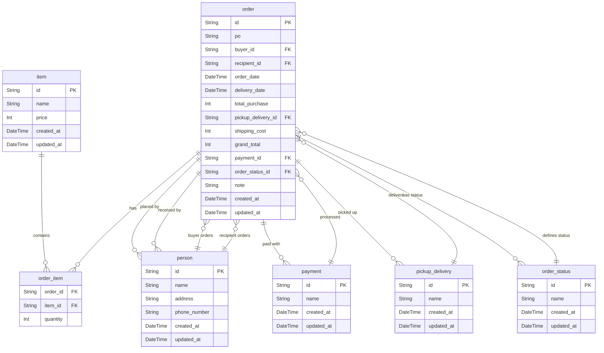

# ERD

```mermaid
erDiagram
    item {
        String id PK
        String name
        Int price
        DateTime created_at
        DateTime updated_at
    }

    order {
        String id PK
        String po
        String buyer_id FK
        String recipient_id FK
        DateTime order_date
        DateTime delivery_date
        Int total_purchase
        String pickup_delivery_id FK
        Int shipping_cost
        Int grand_total
        String payment_id FK
        String order_status_id FK
        String note
        DateTime created_at
        DateTime updated_at
    }

    order_item {
        String order_id FK
        String item_id FK
        Int quantity
    }

    person {
        String id PK
        String name
        String address
        String phone_number
        DateTime created_at
        DateTime updated_at
    }

    payment {
        String id PK
        String name
        DateTime created_at
        DateTime updated_at
    }

    pickup_delivery {
        String id PK
        String name
        DateTime created_at
        DateTime updated_at
    }

    order_status {
        String id PK
        String name
        DateTime created_at
        DateTime updated_at
    }

    item ||--o{ order_item : "contains"
    order ||--o{ order_item : "has"
    order ||--o{ person : "placed by"
    order ||--o{ person : "received by"
    order ||--o{ payment : "paid with"
    order ||--o{ pickup_delivery : "picked up"
    order ||--o{ order_status : "has status"
    person ||--o{ order : "buyer orders"
    person ||--o{ order : "recipient orders"
    payment ||--o{ order : "processes"
    pickup_delivery ||--o{ order : "delivers"
    order_status ||--o{ order : "defines status"
```
