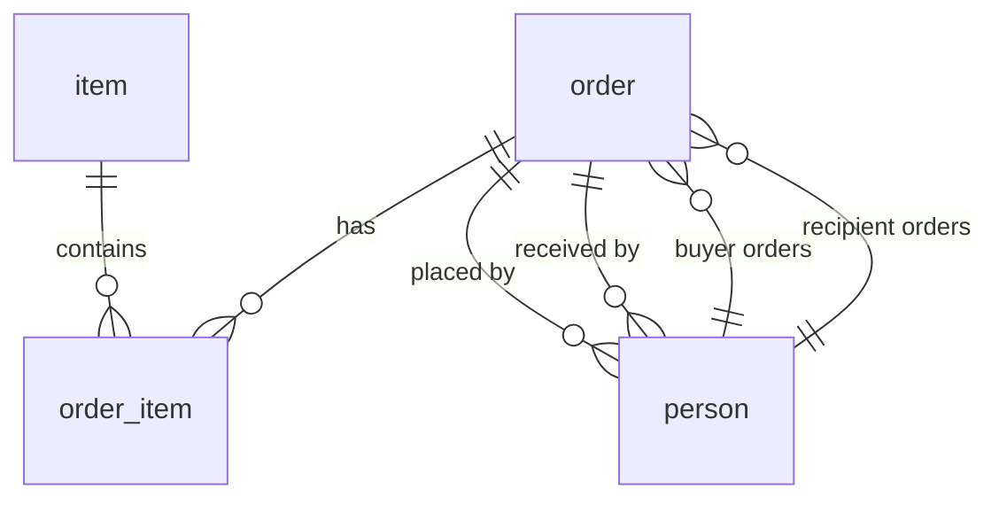

# ERD

```mermaid
erDiagram
    item
    order
    order_item
    person

    item ||--o{ order_item : "contains"
    order ||--o{ order_item : "has"
    order ||--o{ person : "placed by"
    order ||--o{ person : "received by"
    person ||--o{ order : "buyer orders"
    person ||--o{ order : "recipient orders"
```
